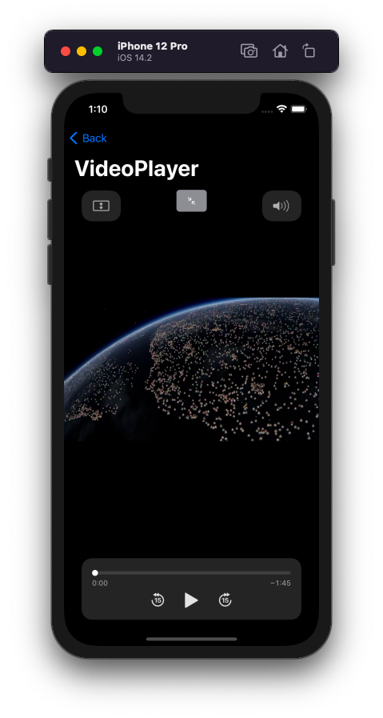

#  ViewComponents

An app demonstrating all new components realeased in SwiftUI 2.0

### Content
* DatePicker
* ProgressView
* ColorPicker
* Label
* Link
* TextEditor
* VideoPlayer

## iOS

## macOS

